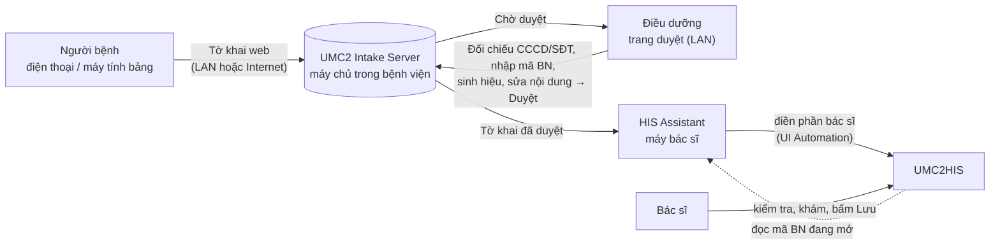

# UMC2 HIS Suite — Tờ khai trước khám → Điều dưỡng duyệt → Điền vào HIS

Người bệnh tự khai thông tin trên điện thoại/máy tính bảng. Điều dưỡng đối chiếu, bổ sung sinh hiệu, gắn mã bệnh nhân HIS và **duyệt**. Khi bác sĩ mở hồ sơ bệnh nhân đó trên UMC2HIS, trợ lý trên máy bác sĩ **tự nhận ra** bệnh nhân, hiện tờ khai đã duyệt và **điền phần bác sĩ** (lý do khám, bệnh sử, tiền sử, dị ứng, sinh hiệu…) chỉ bằng một cú bấm. Bác sĩ vẫn kiểm tra và tự bấm **Lưu** trên HIS.

Không sửa source hay database của HIS: việc điền dùng Microsoft UI Automation giống thao tác gõ phím, có kiểm tra trước và đối chiếu mã bệnh nhân.

## Thành phần

| Thư mục | Chạy ở đâu | Việc làm |
| --- | --- | --- |
| `src/IntakeServer` | 1 máy trong bệnh viện (Windows Service) | Tờ khai người bệnh, trang duyệt cho điều dưỡng, hàng chờ cho máy bác sĩ. Dữ liệu mã hóa, tự xóa theo hạn. |
| `src/HisAdmissionAssistant` | Từng máy bác sĩ (cạnh UMC2HIS) | Nhận diện BN đang mở trên HIS, ghép tờ khai đã duyệt, điền vào HIS. Có **bảng gọn luôn nổi**. |
| `deploy/` | — | Script cài đặt 1 lần cho máy chủ (cần Admin) và máy bác sĩ (không cần Admin). |
| `tools/MockHis`, `tests/` | Máy lập trình | HIS giả để thử không cần dữ liệu thật; kiểm thử UIA và kiểm thử máy chủ. |

Cả hai chương trình chỉ cần **.NET Framework 4** có sẵn trên Windows 10/11 — không cài thêm Node, Python, SQL hay NuGet. Giao diện web được nhúng trong `IntakeServer.exe` (một file duy nhất).

## Cài đặt nhanh

1. **Build** trên máy có mã nguồn (PowerShell): `.\build.ps1 -Test` → tạo `dist\UMC2-HIS-Suite-<phiên bản>\` và file `.zip` (đã chạy 25 bước kiểm thử máy chủ).
2. **Máy chủ tờ khai**: chép thư mục `1-may-chu-to-khai` sang máy chủ, chạy `CAI-DAT-MAY-CHU.cmd` (tự xin quyền Admin). Mở `http://localhost:8080` trên chính máy đó để tạo tài khoản quản trị, rồi vào **Mã QR & kết nối** để in áp phích QR.
3. **Máy bác sĩ**: chạy `CAI-DAT-MAY-BAC-SI.cmd` trong thư mục `2-may-bac-si`. Trên trang quản trị chọn **Quản trị → Máy bác sĩ → Tạo mã ghép nối**; trong trợ lý bấm **Ghép nối máy chủ… → Tự tìm** và nhập mã 6 số.

Hướng dẫn đầy đủ cho phòng CNTT: [docs/TRIEN-KHAI.md](docs/TRIEN-KHAI.md). Kiến trúc và API: [docs/KIEN-TRUC-API.md](docs/KIEN-TRUC-API.md).

## Luồng hằng ngày

- **Người bệnh**: quét QR (Wi‑Fi bệnh viện, máy tính bảng ở quầy với `?kiosk=1`, hoặc từ nhà nếu bật Internet) → khai 5 bước (3–5 phút) → nhận **mã tờ khai** như `K7P-29Q`.
- **Điều dưỡng**: gõ mã vào ô tìm kiếm → đối chiếu CCCD/SĐT → nhập **mã BN trên HIS** (quét mã vạch phiếu khám được) → đo sinh hiệu → sửa bản nháp soạn sẵn → **Duyệt & chuyển bác sĩ** (`Ctrl+Enter`).
- **Bác sĩ**: mở hồ sơ BN trên HIS → bảng gọn góc màn hình báo **✔ Có tờ khai** → bấm **ĐIỀN VÀO HIS** → kiểm tra, khám, bấm Lưu trên HIS → bấm **✓ ĐÃ LƯU**.

## Khai từ nhà qua Internet

Chỉ **cổng tờ khai người bệnh** (mặc định 8081) được đưa ra Internet; trang điều dưỡng và API máy bác sĩ (8080) luôn chỉ trả lời IP nội bộ, kể cả khi cấu hình nhầm.

- **Thử nghiệm**: cài bằng `install-server.ps1 -WithTunnel`, rồi bật **Đường hầm tạm** trong trang quản trị → nhận địa chỉ `https://….trycloudflare.com` và mã QR (đổi địa chỉ mỗi lần khởi động lại).
- **Chính thức**: tạo Cloudflare Tunnel có tên miền riêng, trỏ về `http://localhost:8081`, cài bằng `install-server.ps1 -TunnelToken "<token>"`, nhập địa chỉ ở **Cài đặt → Địa chỉ công khai**. Có thể dùng reverse proxy/DMZ sẵn có của bệnh viện thay cho Cloudflare.

Việc đưa dữ liệu sức khỏe qua Internet cần phòng CNTT và bộ phận pháp chế của bệnh viện đồng ý (xem mục tuân thủ trong hướng dẫn triển khai).

## An toàn và bảo mật

- **Không tự lưu, không tự ký**: trợ lý chỉ điền; bác sĩ tự bấm Lưu. Selector giống nút Lưu/Xác nhận bị chặn.
- **Đối chiếu bệnh nhân 3 lớp**: máy chủ không cho nhận tờ khai nếu mã BN trên màn hình khác mã điều dưỡng đã duyệt; trợ lý đọc lại mã BN ngay trước khi điền; trường `PatientId` ở chế độ `Verify` hủy toàn bộ lượt điền nếu không khớp. Ghép theo họ tên + năm sinh luôn cần bác sĩ xác nhận.
- **Không ghi đè** nội dung bác sĩ đã gõ trên HIS: mặc định chỉ điền ô trống.
- **Máy chủ**: dữ liệu mã hóa DPAPI trên đĩa, tự xóa sau 3 ngày (chưa duyệt) / 7 ngày (đã xong); mật khẩu PBKDF2; phiên đăng nhập HttpOnly + SameSite; chống CSRF; giới hạn tần suất gửi/đăng nhập; CSP chặt; nhật ký kiểm toán không chứa tên, SĐT, mã BN hay nội dung lâm sàng.
- **Máy bác sĩ**: mỗi máy có khóa riêng (ghép bằng mã 6 số dùng 1 lần), lưu mã hóa DPAPI theo tài khoản Windows, thu hồi được từ trang quản trị. Dữ liệu bệnh nhân chỉ nằm trong RAM.

## Hiệu chỉnh selector tại máy HIS

- Tab **Hiệu chỉnh UIA** → **Quét control** hoặc **Bắt control sau 3 giây** để lấy `AutomationId` thật của từng ô trên UMC2HIS; bấm **Lưu profile** (lưu vào `%LOCALAPPDATA%\UMC2\HisAdmissionAssistant\Profiles`, không chứa dữ liệu bệnh nhân).
- Nhận diện bệnh nhân dựa vào trường `PatientId` (`Verify`) của profile, cộng hai trường chỉ đọc **Họ tên BN** (`PatientName` = `hoten`) và **Năm sinh BN** (`BirthYear` = `namsinh`, chỉ có trên màn hình Khám bệnh) — chế độ `Read`, không bao giờ bị ghi — để ghép được cả tờ khai điều dưỡng chưa gắn mã BN. Mỗi lần dò, trợ lý đọc lại cả mã, họ tên, năm sinh; trước khi điền đọc lại lần nữa và dừng nếu bất kỳ giá trị nào đổi.
- Selector ghép `a+b` (ví dụ `mabn1+mabn3`) chỉ dùng cho trường Đọc/Đối chiếu: nối giá trị các ô; thiếu một ô là coi như chưa mở bệnh nhân.
- Trước khi ghi, mọi ô đích được kiểm tra: ô chỉ đọc hoặc không nhận chữ (ví dụ ô tra cứu ICD/khoa) làm dừng toàn bộ lượt điền; sau khi ghi, trợ lý đọc lại từng ô và báo nếu HIS hiển thị khác.
- Trường không có `AutomationId`/`Name` sẽ không được điền (không còn đoán "ô Edit đầu tiên").

## Kiểm thử không dùng dữ liệu thật

- `.\build.ps1 -Test`: khởi động máy chủ với dữ liệu tạm, chạy 25 kiểm tra (gửi tờ khai, đồng ý xử lý dữ liệu, tách cổng, CSRF, thiết lập, duyệt, ghép nối, tự dò tìm, ghép theo mã BN, chặn sai bệnh nhân, nhận/hoàn tất, thu hồi, mã hóa, nhật ký sạch).
- `.\build.ps1 -Smoke`: mở Mock HIS và kiểm tra điền + đọc lại, trường chỉ đọc, xuống dòng CRLF, không ghi đè, hủy khi sai BN, chặn nút Lưu, dừng khi có ô không ghi được, mã BN ghép hai ô, tự nhận diện và đổi bệnh nhân. Bộ đếm **Số lần bấm Lưu** phải luôn là `0`.
- Thử tay: chạy `tools\MockHis\bin\Release\MockHis.exe`, chọn bệnh nhân thử, duyệt một tờ khai với mã `BN-TEST-001` trên trang điều dưỡng rồi dùng profile **Kiểm thử — Mock HIS**.

## Giới hạn hiện tại

- `AutomationId` trong profile UMC2 lấy từ metadata assembly (kể cả họ tên `hoten`, năm sinh `namsinh`, mã BN ghép `mabn1+mabn3` trên màn hình Khám bệnh — xem `ANALYSIS.md`), cần xác nhận một lần trên máy HIS thật bằng **Kiểm tra selector**. Ô tra cứu ICD/khoa (UserControl DevExpress) không điền được qua UI Automation — bác sĩ chọn trên HIS.
- Máy chủ phải bật thì người bệnh mới khai được; nên đặt trên máy chạy liên tục.
- Chế độ cũ (tab **Đồng bộ webapp**, gói pilot JSON, `/api/agent/jobs/*`) vẫn dùng được và tương thích với máy chủ mới.
